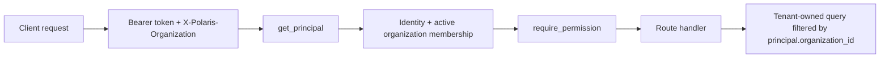

# Phase 1.1 Tenant Security Architecture

Status date: 2026-07-29

## Boundary

`AuthenticatedPrincipal` is the boundary object for protected HTTP requests. It contains the authenticated identity, active membership, role permissions, and `organization_id` selected by `X-Polaris-Organization`.



## Request Rules

1. Route handlers derive organization context only from `AuthenticatedPrincipal.organization_id`.
2. Tenant-owned service methods accept `organization_id` explicitly.
3. Tenant-owned SQLAlchemy models carry `organization_id` foreign keys.
4. Mutations require write permissions; reads require read permissions.
5. Platform-wide organization administration requires `platform.admin`.

## QuickBooks Architecture

QuickBooks is tenant-sensitive because OAuth credentials and financial cache records grant access to accounting data.

```mermaid
flowchart LR
    User[Connector manager] --> Authorize[/authorize]
    Authorize --> State[Signed OAuth state: org + identity + expiry]
    State --> Callback[/callback]
    Callback --> Atomic[Atomic consume where unused and unexpired]
    Atomic --> Credential[Credential stored by organization_id]
    Credential --> Financial[Financial reads/sync/status scoped by organization_id]
```

The callback remains public at the HTTP layer, but the state record is the authorization artifact. State consumption uses an atomic conditional update so concurrent callbacks cannot both succeed.

## Permission Split

- Read-only surfaces use `*.read` permissions.
- Mutating surfaces use `*.write` permissions.
- Legacy `*.manage` names remain aliases only for compatibility.
- Financial operations use `financial.read` and `financial.write`, not generic connector permissions.

## Data Ownership

The authoritative ownership inventory is `docs/security/tenant-isolation.md`.
